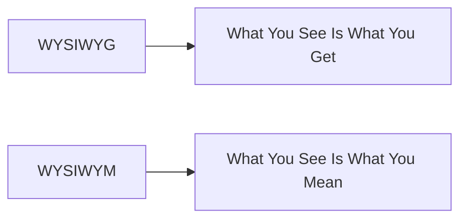
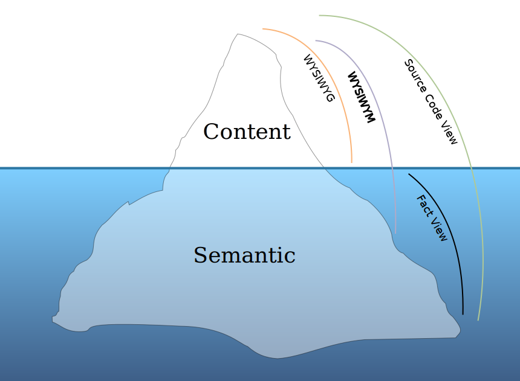

# Markdown Manual & Worksheet

This is both a manual and a worksheet for Markdown. Feel free to do changes to this file!

> Use `git restore worksheet.md` to restore the entire file.


The URL for this image is <http://vi.sjtu.edu.cn/uploads/files/22fc9c46e0998e2454d64f7eda901595-d2c02ba527abb94ad97653e36bbac8a1.png>

| Date      | Time  |
| ------------ | --------------------- |
| Oct. 6th | UTC + 8 20:00 PM |

***

## What is Markdown?

Markdown is a lightweight markup language that you can use to add formatting elements to plaintext text documents. Created by John Gruber in 2004, Markdown is now one of the world’s most popular markup languages.

Using Markdown is different than using a WYSIWYG editor (instead it's a WYSIWYM language). In an application like Microsoft Word, you click buttons to format words and phrases, and the changes are visible immediately. Markdown isn’t like that. When you create a Markdown-formatted file, you add Markdown syntax to the text to indicate which words and phrases should look different.





> By Traced by User:Jc86035 - Traced from File:ViewsIceberg.jpg, by User:Hyperir, CC BY-SA 3.0, <https://commons.wikimedia.org/w/index.php?curid=31633159>

For example, to denote a heading, you add a number sign before it (e.g., `# Heading One`). Or to make a phrase bold, you add two asterisks before and after it (e.g., `**this text is bold**`). It may take a while to get used to seeing Markdown syntax in your text, especially if you’re accustomed to WYSIWYG applications.

You can add Markdown formatting elements to a plaintext file using a text editor application. Or you can use one of the many Markdown applications for macOS, Windows, Linux, iOS, and Android operating systems. There are also several web-based applications specifically designed for writing in Markdown. Depending on the application you use, you may not be able to preview the formatted document in real time. But that’s okay. According to Gruber, Markdown syntax is designed to be readable and unobtrusive, so the text in Markdown files can be read even if it isn’t rendered.

> The overriding design goal for Markdown’s formatting syntax is to make it as readable as possible. The idea is that a Markdown-formatted document should be publishable as-is, as plain text, without looking like it’s been marked up with tags or formatting instructions.

## Why Use Markdown?

You might be wondering why people use Markdown instead of a WYSIWYG editor. Why write with Markdown when you can press buttons in an interface to format your text? As it turns out, there are several reasons why people use Markdown instead of WYSIWYG editors.

- Markdown can be used for everything. People use it to create websites, documents, notes, books, presentations, email messages, and technical documentation.
- Markdown is portable. Files containing Markdown-formatted text can be opened using virtually any application. If you decide you don’t like the Markdown application you’re currently using, you can import your Markdown files into another Markdown application. That’s in stark contrast to word processing applications like Microsoft Word that lock your content into a proprietary file format.
- Markdown is platform independent. You can create Markdown-formatted text on any device running any operating system.
- Markdown is future proof. Even if the application you’re using stops working at some point in the future, you’ll still be able to read your Markdown-formatted text using a text editing application. This is an important consideration when it comes to books, university theses, and other milestone documents that need to be preserved indefinitely.
- Markdown is everywhere. Websites like Reddit and GitHub support Markdown, and lots of desktop and web-based applications support it.

## Kicking the Tires

The best way to get started with Markdown is to use it. That’s easier than ever before thanks to a variety of free tools.

You don’t even need to download anything. There are several online Markdown editors that you can use to try writing in Markdown. [Dillinger](https://dillinger.io/) is one of the best online Markdown editors. Just open the site and start typing in the left pane. A preview of the rendered document appears in the right pane.

You’ll probably want to keep the Dillinger website open as you read through this guide. That way you can try the syntax as you learn about it. After you’ve become familiar with Markdown, you may want to use a Markdown application that can be installed on your desktop computer or mobile device, which we will provide [here](#recommended-editor).

## How Does it Work?

Dillinger makes writing in Markdown easy because it hides the stuff happening behind the scenes, but it’s worth exploring how the process works in general.

When you write in Markdown, the text is stored in a plaintext file that has an `.md` or `.markdown` extension. But then what? How is your Markdown-formatted file converted into HTML or a print-ready document?

The short answer is that you need a _Markdown application_ capable of processing the Markdown file. There are lots of applications available — everything from simple scripts to desktop applications that look like Microsoft Word. Despite their visual differences, all of the applications do the same thing. Like Dillinger, they all convert Markdown-formatted text to HTML so it can be displayed in web browsers.

Markdown applications use something called a _Markdown processor_ (also commonly referred to as a “parser” or an “implementation”) to take the Markdown-formatted text and output it to HTML format. At that point, your document can be viewed in a web browser or combined with a style sheet and printed. You can see a visual representation of this process below.

**Note:** The Markdown application and processor are two separate components. For the sake of brevity, I've combined them into one element ("Markdown app") in the figure below.


To summarize, this is a four-part process:

1. Create a Markdown file using a text editor or a dedicated Markdown application. The file should have an .md or .markdown extension.
2. Open the Markdown file in a Markdown application.
3. Use the Markdown application to convert the Markdown file to an HTML document.
4. View the HTML file in a web browser or use the Markdown application to convert it to another file format, like PDF.

From your perspective, the process will vary somewhat depending on the application you use. For example, Dillinger essentially combines steps 1-3 into a single, seamless interface — all you have to do is type in the left pane and the rendered output magically appears in the right pane. But if you use other tools, like a text editor with a static website generator, you’ll find that the process is much more visible.

## Recommended Editor

- Typora (WYSIWYG Style)
- iA Writer
- Atom
- Notion
- Obsidian
- VS Code
- GitHub
- Online Editors (If you really want one)
  - [Dillinger](https://dillinger.io/)
  - [SJTU Markdown](https://notes.sjtu.edu.cn/)

---

## Basic Syntax

You can find most of the syntax above, and you're very encouraged to play around these syntax.

### Heading

`##..##(n) Heading` means Heading with level n. n can be 1~6.

**Note:** There is a space between the number signs (#) and Heading name.

### Paragraph

Paragraph 1...

Paragraph 2...

Actually there is a blank line between two paragraphs.

```markdown
Paragraph 1...

Paragraph 2...

Actually there is a blank line between two paragraphs.
```

**Note:** Do not try to indent paragraphs with spaces or tabs. Some editors like Typora support indentation.

### Line Break

To create a line break or new line,  end a line with two or more spaces, and then type `return`.

### Emphasis

- Bold: `**bold text**` or `__bold text__`.
  - **Note**: `A**B**C` is OK, `A__B__C` is not OK.
- Italic: `*italicize text*` or `_italicize text_`.
  - Note: `A*B*C` is OK, `A_B_C` is not OK.
- Bold and Italic: `***` or `**_` or `*__` or `___`.

### Blockquote

```markdown
> Paragraph 1
>
> > Paragraph 2
```

> Paragraph 1
>
> > Paragraph 2

### List

```markdown
- Ordered List
  a. aaaa
  b. bbbb
- Unordered List
  - aaaa
  - bbbb
```

- Ordered List
  a. aaaa
  b. bbbb
- Unordered List
  - aaaa
  - bbbb

### Code

`Use`code`to show code`

```markdown
Use ``` to build a code block
```

```markdown
```c
int main()
{
    return 0;
}
```

```c
int main()
{
    return 0;
}
```

## Lab Structure

In the labs, you will be required to do the following:

1. Skills
2. _Programming Exercises_ (**Basic Exercises** and _**Advanced Exercises**_)
3. Demo projects

You can create a table by some tools like [_tables generator_](https://www.tablesgenerator.com/markdown_tables).

## ~~_Survive_~~ Learning well in the lab

Perhaps here's some suggestions:

- Follow the lab instructions.
- Seek for help if necessary.
  - If you got stuck on one task, jump it and ask after the lab.
- Finish the lab exercises in time.

## Sample Code

In the programming exercise part, you will be asked to write good code in `MATLAB` , `C` and `C++`.

### C

### MATLAB

```matlab
function d=density(r,c,T) %Think about what this function mean!
    G=6.674*10^-11;
    V=4*pi/3*(c/(2*pi))^3;
    M=4*pi^2*r^3/(G*T^2);
    d=M/V;
end
```

## Work with $\LaTeX$

**There is no standard how to insert $\LaTeX$ content. Some editors use `$` while some use `$$` and some editors use other methods. Test in your editor. Piazza use `$$`.**

You can use $\LaTeX$ in the markdown file. For example, $$1 + 2 + 3 + \cdots + 100 = \frac{(1+100)\times 100}{2} = 5050$$

---

## Check list

- [ ] Welcome
  - [x] headings (different levels)
  - [x] images
  - [x] quote
  - [x] table
  - [x] link
  - [x] list
  - [x] bold & italic & strikethrough
  - [x] code
    - [x] Inline
    - [x] Block
  - [x] $\LaTeX$
  - [ ] task list & horizontal line
